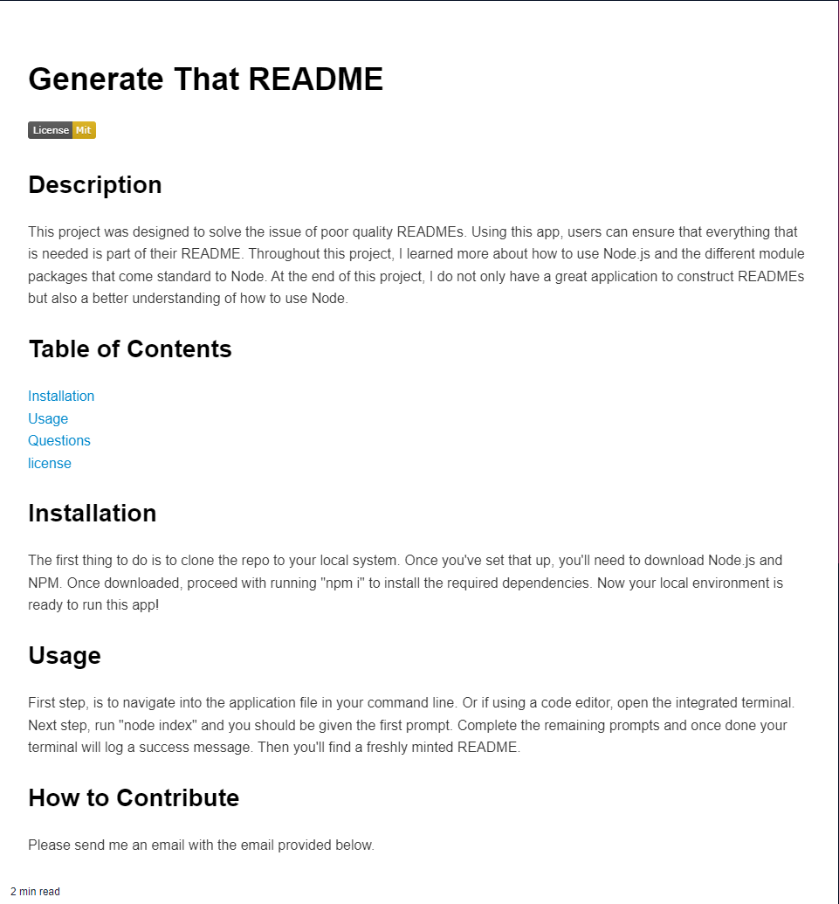

# Generate That README

## Description
    
This project was designed to solve the issue of poor quality READMEs. Using this app, users can ensure that everything that is needed is part of their README. Throughout this project, I learned more about how to use Node.js and the different module packages that come standard to Node. At the end of this project, I do not only have a great application to construct READMEs but also a better understanding of how to use Node. 
    
## Table of Contents
    
[Installation](#installation)
[Usage](#usage)
[Questions](#questions)
[license](#license)
    
## Installation
    
The first thing to do is to clone the repo to your local system. Once you've set that up, you'll need to download Node.js and NPM. Once downloaded, proceed with running "npm i" to install the required dependencies. Now your local environment is ready to run this app!
    
## Usage

First step, is to navigate into the application file in your command line. Or if using a code editor, open the integrated terminal. Next step, run "node index" and you should be given the first prompt. Complete the remaining prompts and once done your terminal will log a success message. Then you'll find a freshly minted README.

Example output:

[Node.js Challenge 9 Video.zip](https://github.com/the-real-chrisp/Generate-That-README/files/13432234/Node.js.Challenge.9.Video.zip)

## How to Contribute

Please send me an email with the email provided below.

## Tests
    
Try not entering a value for one of the prompts!

## Questions:

Link to GitHub:
[GitHub](https://github.com/the-real-chrisp)
    
Send email if you have questions or want to contribute:
chrisp0000@gmail.com

## License
    This project is under Mit license.
  
